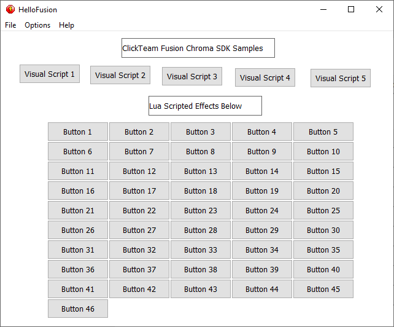
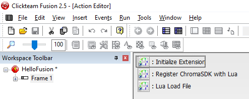
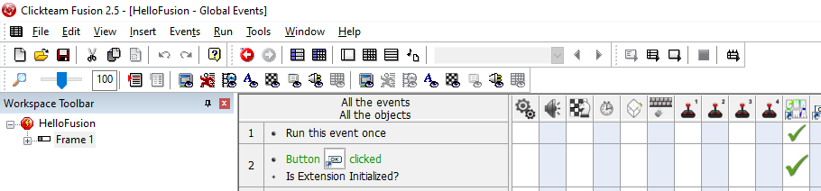
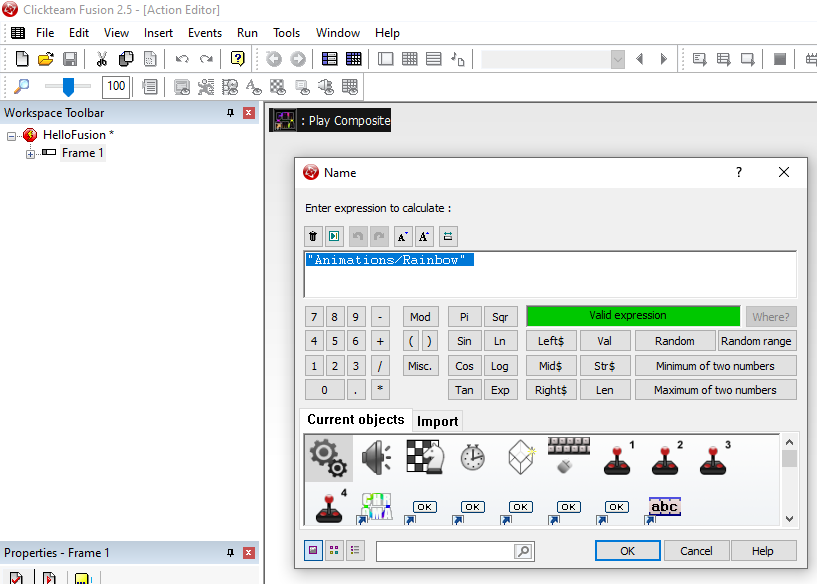
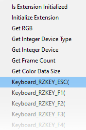

# Latest

* Note: Visit the [Chroma Animation Guide](https://chroma.razer.com/ChromaGuide/) to find the latest supported plugin for Chroma RGB.

# ClickTeam Fusion Chroma SDK Extension

* Note: The Chroma SDK Extension requires Fusion 2.5 Standard Edition and is built for the Windows platform only!

**Table of Contents**

* [See Also](#see-also)
* [About](#about)
* [Quick Start](#quick-start)
* [Project Setup](#project-setup)
* [Actions](#actions)
* [Expressions](#expressions)
* [Building the Chroma SDK Extension from Source](#building-the-chroma-sdk-extension-from-source)

<a name="see-also"></a>
## See Also

**Docs:**

- [Chroma Animation Guide](http://chroma.razer.com/ChromaGuide/) - Visual examples of the Chroma Animation API methods

**Plugins:**

- [CChromaEditor](https://github.com/RazerOfficial/CChromaEditor) - C++ native MFC library for playing and editing Chroma animations

<a name="about"></a>
## About

The Chroma SDK Extension provides a `ChromaSDK` object with `actions`, `conditions`, and `expressions` available for visual scripting. The extension also makes the API available to `Lua` scripting.

* Sample: [HelloFusion](HelloFusion)

* The `HelloFusion` project is a `ClickTeam Fusion 2.5 Standard` sample app that shows the animations from the [Chroma Animation Guide](http://chroma.razer.com/ChromaGuide/).

* The sample has visual scripted sample effects and numerous buttons with behaviors that play effects defined by the `Lua` [SampleScript.lua](HelloFusion/Sample.lua).

* Buttons pass their object name to lua via the `Lua Load String` action.

```
"ExecuteEffect(""" + OName$( "Button 1" ) + """)"
```

* The first button is cloned to a 10x5 grid which also clones the behaviors. The button text is set dynamically with the object name.

**Screenshot:**



**Video:**

**ClickTeam Fusion - Chroma SDK Extension**

<a target="_blank" href="https://www.youtube.com/watch?v=PMge5EWzxDM"></a>

### Quick Start

* Install [Synapse](https://www.razer.com/synapse-3)

* Make sure the Chroma Connect module is installed.


* If you don't have Chroma hardware, you can see Chroma effects with the [Chroma Emulator](https://github.com/razerofficial/ChromaEmulator)

* Copy [ChromaSDK.mfx](https://github.com/RazerOfficial/ClickTeamFusion_ChromaSDK/releases) to ```C:\Program Files (x86)\Clickteam Fusion 2.5\Extensions\Unicode```

* Restart ClickTeam Fusion

* Open Extension Manager and click `Refresh`

* Extension manager should show the `ChromaSDK`


### Project Setup

* Create New Object should show the `ChromaSDK` as an available object type


* Import the `ChromaSDK` object to global events to make the functions available


* Use the `Frame Start` or `Run Once` condition to invoke the `Initialize Extension` action. This action should be invoked before any other `ChromaSDK` actions are used.



* The `Register ChromaSDK with Lua` action makes the `ChromaAnimationAPI` available for `Lua` scripting.

* The `Lua Load File` action will load and execute `Lua` script from a file.

* Use the `ChromaSDK` condition `Is Extension Initialized` before invoking the `Chroma SDK` actions.



* The `PlayComposite` action will play all the animations for the device set. This includes ChromaLink, Headset, Keyboard, Keypad, Mouse, and Mousepad device animations.



### Actions

**Setup**

* `Initialize Extension` - Initialize the `ChromaSDK` if available. Always check the condition `Is Extension Initialized` before calling other methods. This will make sure the user has `Chroma`.

**Lua**

* `Register ChromaSDK with Lua` - Expose the `ChromaSDK` methods to `Lua` script.

* `Lua Load String` - Execute a `Lua` string. This makes it possible to invoke `Lua` functions.

* `Lua Load File` - Load a `Lua` file and execute the script. Use this to define functions that can be called with `Lua Load String`.

**Colors**

* `Set Device to RGB` - Set a device to a single `RGB` color.

* `Set All Devices to RGB` - Set all `Chroma` connected devices to a single `RGB` color.

* `Lerp All Frames Between Two Colors with Frame RGB Data as Input` - Use grayscale input from the existing animation to transition between two colors.

* `Lerp All Frames Between Two Colors with Frame RGB Data as Input (Ignore Blank RGB Values)` - Same as above, except ignore unset colors.

* `Fill All Frames with Color where RGB is Blank` - Set all colors to a single `RGB` color where the existing color is not set.

* `Offset All Frames with RGB Offset` - Add `RGB` values to the existing animation colors.

* `Set Frame Color Data by Index` - Set individual colors by frame and index. Use the expression `Get Frame Count` to the total number of frames. Frame index is zero based. Use the expression `Get Color Data Size` to get the total number of color indexes. Color index is zero based.

**Animations**

* `Get Animation` - Load a `Chroma` animation into memory.

* `Play Animation` - Play a `Chroma` animation. If an existing animation was playing on the device, it will be stopped to play the new animation.

* `Stop Animation` - Stop playing a `Chroma` animation if it was playing.

* `Play Composite` - Play a set of `Chroma` animations. The device set includes ChromaLink, Headset, Keyboard, Keypad, Mouse, and Mousepad.

* `Load Animation` - Load `Chroma` effects in memory for playback. This is called automatically by `Play Animation` and `Play Composite`.

* `Unload Animation` - Unload the `Chroma` effects from memory. Call this after an animation has played if color changes are made.

* `Close Animation` - Close a `Chroma` animation. This is useful to reload an animation from disk. This is used for dynamic animations to reset after color changes are made.

**Timing**

* `Duplicate First Frame` - Duplicate the first frame of an animation for a number of times.

* `Duplicate Frames` - Duplicate all the frames of the animation. This will slow the speed of an animation by doubling the frames.

* `Make Blank Frames` - Set the number of frames in the animation to a specific `RGB` color

* `Reduce Frames` - Remove every nth frame of the animation. This expects integers greater or equal to 2.

* `Insert Delay` - Insert a pause in the animation at the given index for a number of frames.

* `Trim Start Frames` - Delete frames until the specified frame index.

* `Trim End Frames` - Delete frames after the specified frame index.

**Layers**

* `Copy All Frames with Source Non-Blank RGB to Target` - Copy animation colors from one animation to another.

* `Copy All Frames with Source Non-Blank RGB to Target Non-Blank RGB` - Same as above, except only copy over existing set colors.

* `Copy Source Animation as Target Animation` - Clone the source animation with the name of the target animation. If the target animation already exists, it will be closed.

* `Append Target Animation to Source Animation` - Append all frames from the source animation at the end of the target animation.

### Expressions

* `Is Extension Initialized` - Checks if the user's system supports the Chroma SDK.

* `Initialize Extension` - Initializes the `ChromaSDK` and returns true upon success.

* `Get RGB` - Returns the integer value from red, green, and blue parameters.

* `Get Integer Device Type` - Accepts strings for "ChromaLink", "Headset", "Keyboard", "Keypad", "Mouse", and "Mousepad" to return the integer `device type`.

* `Get Integer Device` - Accepts strings for "ChromaLink", "Headset", "Keyboard", "Keypad", "Mouse", and "Mousepad" to return the integer `device`.

* `Get Frame Count` - Returns the number of frames for the given animation.

* `Get Color Data Size` - Returns the array size for the `device` for user with the `Set Frame Color Data by Index` action.

* `Keyboard_RZKEY_*` - The expression returns the array index for the given `RZKEY`. This is used to display hotkeys in animations.



### Building Chroma SDK Extension from Source

The Extension binary is built with the following setup:

* Projects are cloned with `C:\Public` as the base folder

* Build `Release` from https://github.com/tgraupmann/XLua (project cloned to `C:\Public\XLua`)

* Build: `Edittime Unicode` from https://github.com/tgraupmann/MMF2Exts/tree/master/DarkEdif/ChromaSDK (project cloned to `C:\Public\MMF2Exts`)

## Support

Contact `Tim Graupmann#0611` on Discord for extension support.
