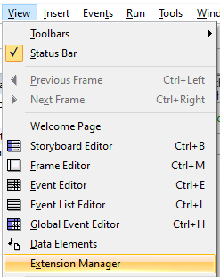
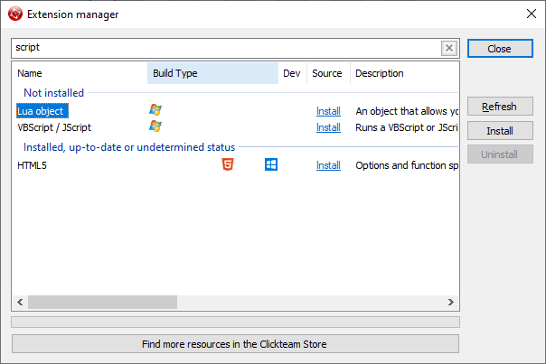
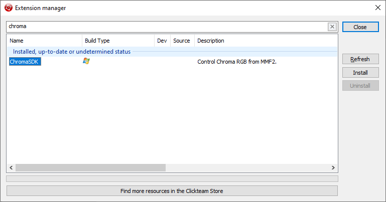
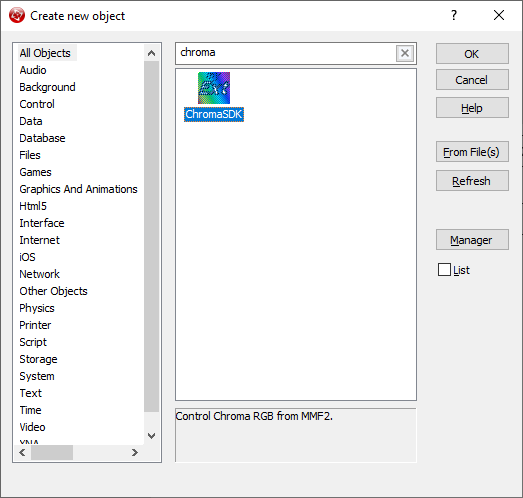
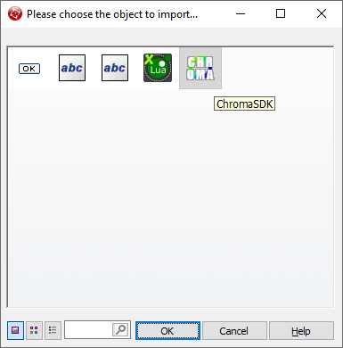

# ClickTeam Fusion Chroma SDK Sample App

* The extension requires Fusion 2.5 Standard Edition

## Setup

* Open the extension manager



* Install `Lua` script support



### Extension Setup

* Copy `ClickTeamFusion_ChromaSDK.mfx` to ```C:\Program Files (x86)\Clickteam Fusion 2.5\Extensions\Unicode```

* Restart ClickTeam Fusion

* Open Extension Manager and click `Refresh`

* Extension manager should show the `ChromaSDK`



* Create New Object should show the `ChromaSDK` as an available object type



* Import the `ChromaSDK` object to global events to make the functions available



## Compiling Extension

* Add the ClickTeam Fusion SDK to the extension Visual Studio C++ `Additional Include Directories`

```%(AdditionalIncludeDirectories);C:\Public\Fusion25SDK\Inc```

* Add the ClickTeam Fusion SDK to the extension Visual Studio Resource `Additional Include Directories`

```%(AdditionalIncludeDirectories);C:\Public\Fusion25SDK\Inc```

* Add the ClickTeam Fusion SDK to the extension Visual Studio Linker `Additional Library Directories`

```C:\Public\Fusion25SDK\Lib```

* Add the ClickTeam Fusion SDK to the extension Visual Studio Linker `Additional Dependencies`

```mmfs2.lib```
